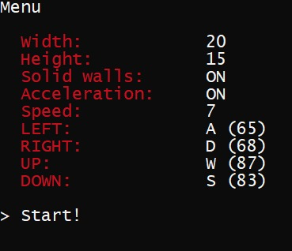

This game is a stylized classical Snake, download it to make some fun, or to get useful code snippets such as various menus, color/font/code_page/cursor changing in console, special input, that restricts you to input anything except digits, examples of Windows.h input methods etc. 

The main logic is in Snake.cpp. Lots of useful functions are in PosControls.cpp, other files are different pages with menus and the game.

This is what you can change by options:

This is how the game looks like:

And there're also additional helpful menus like this one, pause menu or exit confirmation:

Notes:
Your console should work with escape sequences, otherwise you need to rewrite code to output in black and white.

TODO list:
* prevent console window from minimizing after some degree;
* add English comments to the code;
* add console independent color without escape sequences;

